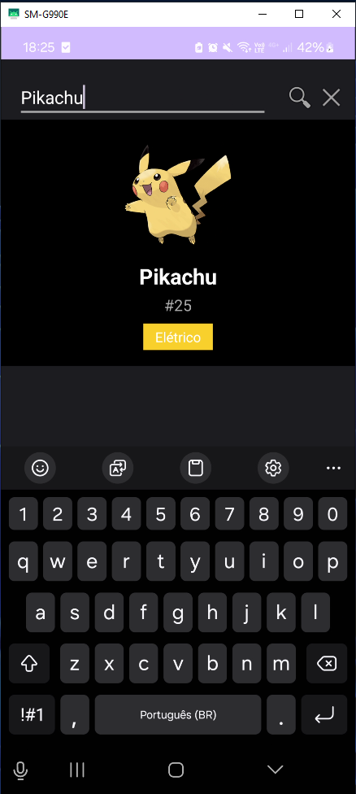
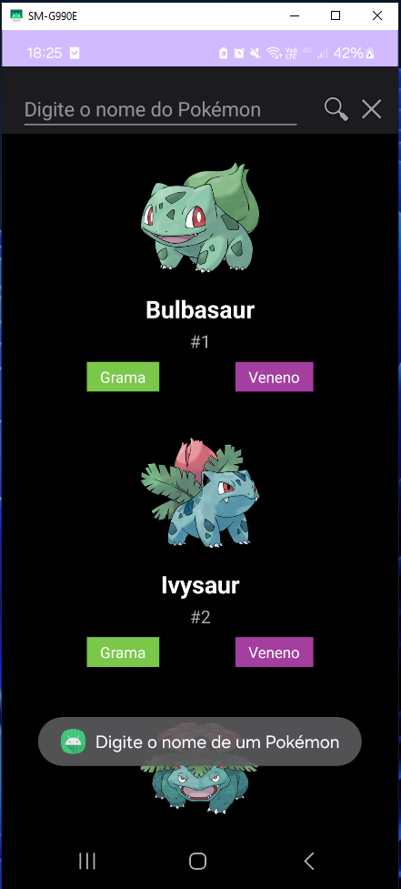
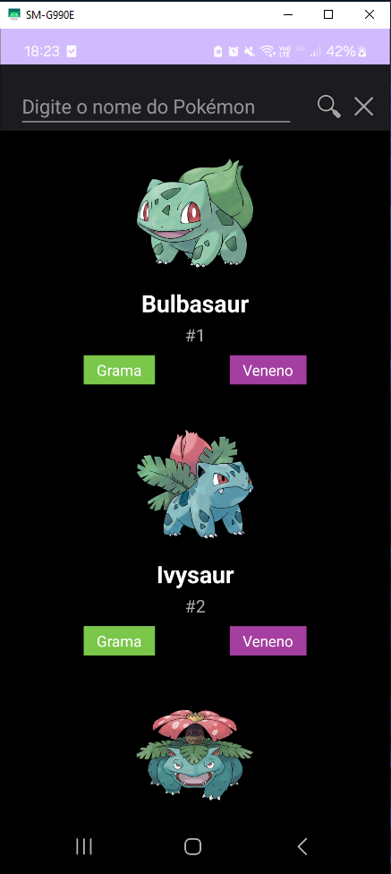

# 📱 PokedexApp - Consumo de API com Android e Kotlin

Este é um projeto desenvolvido para a disciplina de Programação Mobile, onde foi criado um aplicativo de Pokédex utilizando **Kotlin**, **Android Studio** e a **PokéAPI**.

O objetivo foi consumir dados reais da web, exibir os Pokémon com imagem, nome, tipo e número, com recursos de **pesquisa**, **scroll infinito** e **interface moderna**.

---

## 🔧 Tecnologias Utilizadas

- Kotlin
- Android Studio
- ViewModel + LiveData
- Retrofit2 (consumo da PokéAPI)
- RecyclerView
- ConstraintLayout
- Picasso (carregamento de imagens)

---

## 🎯 Funcionalidades

✅ Exibe Pokémons com nome, número, tipos e imagem  
✅ Pesquisa por nome com botão de lupa  
✅ Scroll infinito para carregar mais Pokémons  
✅ Tipos coloridos de acordo com o tipo do Pokémon  
✅ Interface amigável e responsiva  
✅ Botão de "Limpar" para resetar a lista para o Bulbasaur

---

## 🖼️ Screenshots

### 🔍 Pesquisa com resultado:

### ⚠️ Alerta ao não digitar:

### 🧾 Interface principal:

---

## 📦 Como rodar

1. Clone este repositório
2. Abra no Android Studio
3. Execute em um emulador ou dispositivo físico com Android 5.0+

---

## 🔗 API utilizada

- [https://pokeapi.co/](https://pokeapi.co/)

---

## ✍️ Autor

**Lucas Lemos (Luskinha04)**  
Aluno de Análise e Desenvolvimento de Sistemas – IFTM  
Projeto feito com 💜 para fins acadêmicos

---

> **IFTM - Instituto Federal do Triângulo Mineiro**  
> Disciplina: Programação para Dispositivos Móveis  
> 6º Período de ADS – 2025
